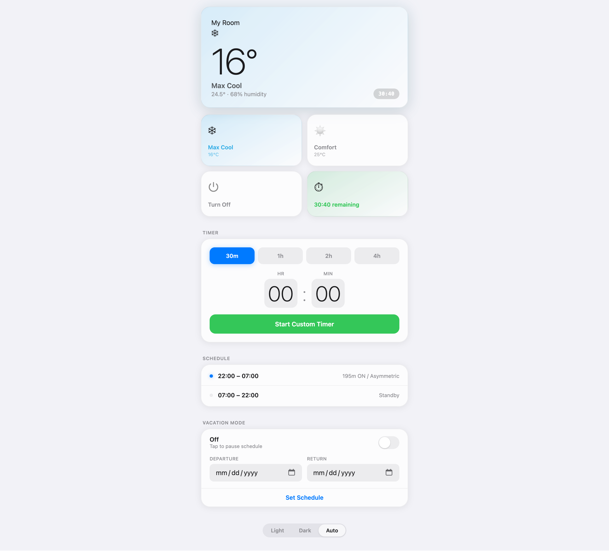

# AC Scheduler

An ESP32-based smart controller for **Daikin air conditioners**, written in **Rust**. Sends IR commands on a configurable nightly schedule, with a clean web dashboard for manual control, timers, and vacation mode.

---

## Features

- **Written in Rust** — memory-safe, zero-cost abstractions, compiled with ESP-IDF & FreeRTOS
- **Host Simulator** — test the web dashboard and scheduler locally on macOS/Linux (`cargo run --bin host-sim`)
- **Asymmetric schedule** — 7 configurable ON/OFF slots per night optimised for Singapore's nocturnal temperature curve (195 min total, 22:00–07:00)
- **Manual control** — Max Cool (16 °C) or Comfort (25 °C) at any time
- **Countdown timer** — presets (30 m / 1 h / 2 h / 4 h) or custom hh:mm
- **Vacation mode** — pause the schedule manually or by calendar date range; persists across reboots in NVS flash
- **BME280 support** — live room temperature & humidity displayed in the dashboard (I²C auto-detect on 0x76 or 0x77)
- **Hardware Watchdog (WDT)** — automatic recovery if any task hangs
- **Post-Boot Recovery** — immediately evaluates the active schedule slot upon power restoration without waiting for the next tick
- **Auto dark mode** — dashboard switches theme automatically at Singapore sunrise/sunset times
- **Configurable Wi-Fi & Static IP** — credentials managed via `cfg.toml` with automatic SoftAP fallback (`AC-Scheduler-Setup`)
- **mDNS discovery** — accessible at `http://ac-scheduler.local`

---

## Dashboard Preview



---

## Hardware

| Component | Notes |
|---|---|
| ESP32-C6 (Seeed XIAO) | Any ESP32 variant works (pin D1 = GPIO 1) |
| IR Transmitter | Connected to pin `D1` (GPIO 1) |
| BME280 (optional) | I²C on SDA=GPIO 22, SCL=GPIO 23; auto-detected at 0x76 or 0x77 |

### Wiring

```text
       ESP32-C6                 IR TRANSMITTER
   +--------------+            +--------------+
   |           5V |---------->| +5V          |
   |          GND |---------->| GND          |
   |      D1 / A1 |---------->| IN (Data)    |
   +--------------+            +--------------+
          |
     [USB-C Power]
```

Point the IR LED at the Daikin unit with a clear line of sight. Keep the ESP32 plugged into a 5V USB-C adapter.

---

## Getting Started

### 1. Local Simulator (Run on macOS / Linux)

You can run the entire scheduler and web dashboard locally without needing the physical board connected:

```bash
cargo run --bin host-sim
```
Open **`http://127.0.0.1:8080`** in any browser.

### 2. Configure Wi-Fi

Copy the example configuration to `cfg.toml` (ignored by git so your secrets stay private):

```bash
cp cfg.toml.example cfg.toml
```

Edit `cfg.toml` with your Wi-Fi credentials:

```toml
[wifi]
ssid = "Your_WiFi_SSID"
password = "Your_WiFi_Password"

# Static IP for fast boot and consistent bookmark
static_ip = "192.168.0.93"
gateway = "192.168.0.1"
subnet = "255.255.255.0"
dns = "192.168.0.1"

# mDNS Hostname (http://ac-scheduler.local)
mdns_hostname = "ac-scheduler"

# Fallback SoftAP mode (if connection fails)
ap_ssid = "AC-Scheduler-Setup"
ap_password = "acsetup01"
```

The fallback AP uses WPA2. Set `ap_password` to your own password (at least 8 characters); the example password is public.

### 3. Flash to ESP32-C6

Ensure you have `espflash` installed:

```bash
cargo install cargo-espflash
```

Flash the firmware:

```bash
cargo espflash flash --release --target riscv32imac-esp-espidf
```

Once connected, open **`http://192.168.0.93/`** or **`http://ac-scheduler.local/`** in your browser.

---

## Web Dashboard

| Section | Description |
|---|---|
| **Hero card** | Current AC status, set temperature, room temp/humidity, active timer countdown |
| **Max Cool** | Turn AC on at 16 °C |
| **Comfort** | Turn AC on at 25 °C |
| **Turn Off** | Turn AC off and cancel any active timer |
| **Timer** | Run AC for a fixed duration, then auto-off |
| **Schedule** | Shows the two schedule windows (night active / day standby) |
| **Vacation Mode** | Toggle pause manually or set a departure/return date range |
| **Theme** | Light / Dark / Auto (auto switches at sunrise/sunset) |

---

## API Endpoints

| Method | Endpoint | Description |
|---|---|---|
| GET | `/` | Serve web dashboard |
| GET | `/cmd?mode=on16` | Turn on at 16 °C (Max Cool) |
| GET | `/cmd?mode=on25` | Turn on at 25 °C (Comfort) |
| GET | `/cmd?mode=off` | Turn off |
| GET | `/timer?min=N` | Start timer for N minutes (max 1440); `min=0` cancels |
| GET | `/status` | Telemetry JSON payload |
| GET | `/vacation_toggle` | Toggle manual vacation mode |
| GET | `/schedule?s=YYYYMMDD&e=YYYYMMDD` | Set vacation date range (`s=0&e=0` to clear) |
| GET | `/reset-wifi` | Returns 501 (unsupported); edit `cfg.toml` and reflash to change credentials |

### `/status` response format

```json
{
  "status": "Max Cool",
  "temp": 16,
  "slot": 1,
  "activeMins": 60,
  "timerSecs": 3542,
  "bmeOk": true,
  "rTemp": 27.4,
  "rHum": 68.0,
  "vacation": false,
  "manVac": false,
  "vacS": 0,
  "vacE": 0,
  "ntpOk": true
}
```

---

## Customising the Schedule

The nightly ON slots are defined in the `SCHEDULE` array in `src/scheduler/engine.rs`:

```rust
pub const SCHEDULE: [CycleSlot; 7] = [
    CycleSlot { start_min: 22 * 60, end_min: 22 * 60 + 45 },      // 22:00 – 22:45 (45 min)
    CycleSlot { start_min: 23 * 60 + 15, end_min: 23 * 60 + 40 }, // 23:15 – 23:40 (25 min)
    CycleSlot { start_min: 0 * 60 + 15, end_min: 0 * 60 + 35 },   // 00:15 – 00:35 (20 min)
    CycleSlot { start_min: 1 * 60 + 20, end_min: 1 * 60 + 40 },   // 01:20 – 01:40 (20 min)
    CycleSlot { start_min: 2 * 60 + 40, end_min: 3 * 60 },        // 02:40 – 03:00 (20 min)
    CycleSlot { start_min: 4 * 60 + 15, end_min: 4 * 60 + 40 },   // 04:15 – 04:40 (25 min)
    CycleSlot { start_min: 5 * 60 + 20, end_min: 6 * 60 },        // 05:20 – 06:00 (40 min)
];
```

The active night window is **22:00 – 07:00**. Outside this window the schedule is in standby and `manual_override` is automatically cleared at 07:00 so the next night resumes normally.

---

## Testing

Run the full automated test suite:

```bash
cargo test
```

Run code linters:

```bash
cargo clippy --all-targets -- -D warnings
```

---

## License

MIT
